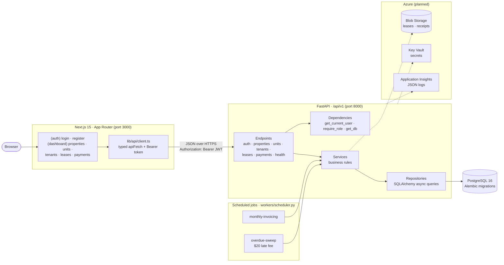
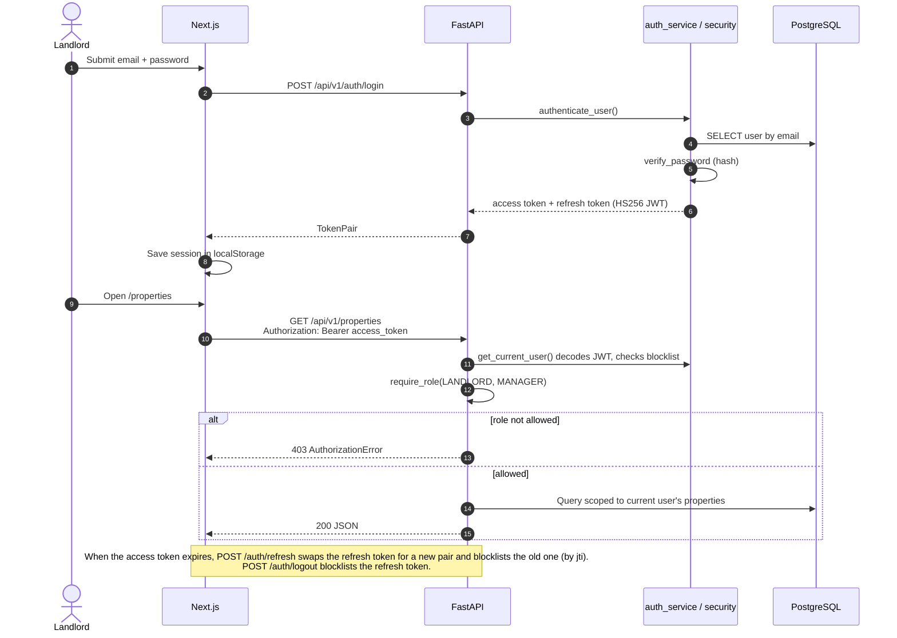
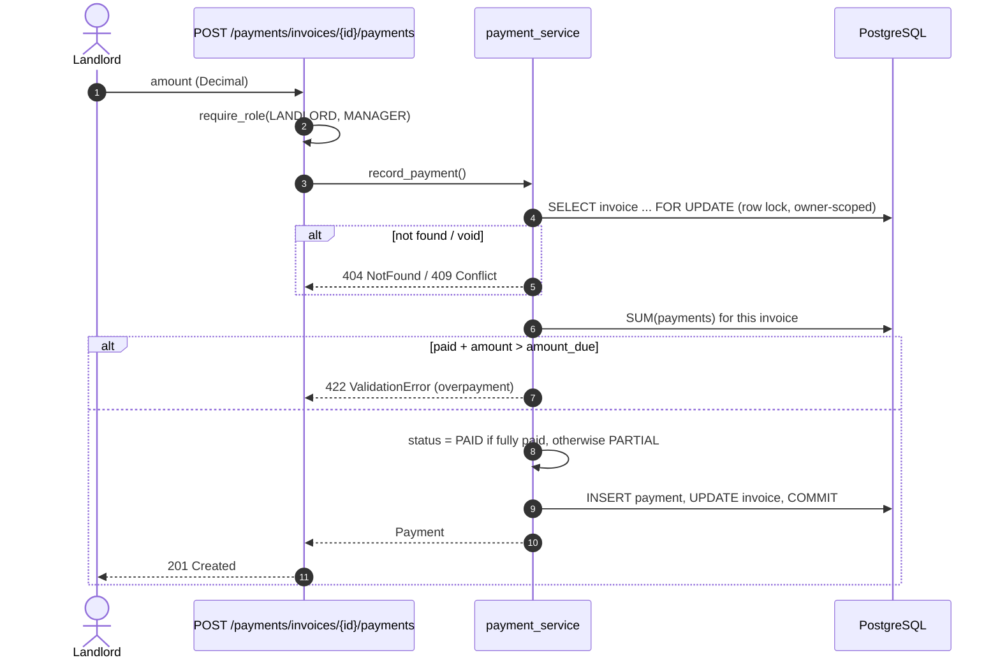
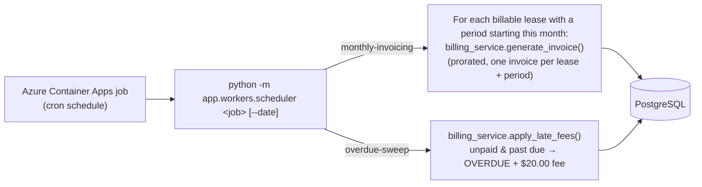
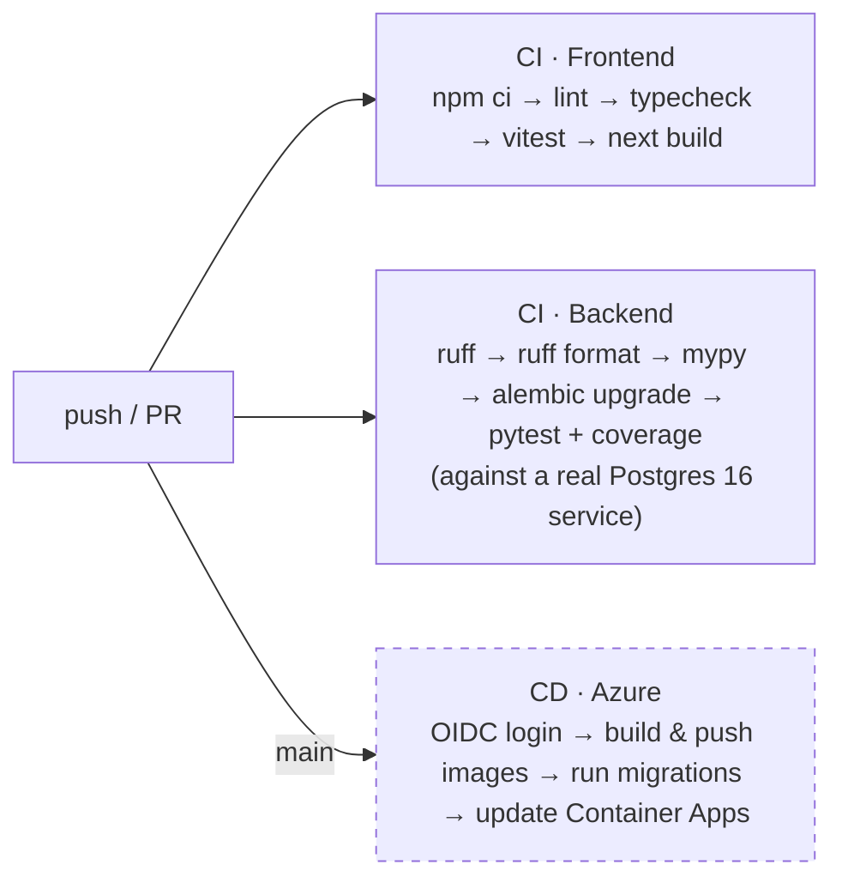

# RentFlow

Property and rent management for small-to-mid landlords: properties, units, tenants, leases, rent collection, and maintenance requests in one place.

> **Status: in active development.** Auth, properties, units, tenants, leases, and billing (invoicing, payments, arrears, late fees) are implemented and tested. Maintenance, documents, notifications, and the Azure deployment are still stubs marked `TODO`.

---

## Stack

| Layer     | Choice                                              |
| --------- | --------------------------------------------------- |
| Frontend  | Next.js (App Router) · React · TypeScript · Tailwind CSS |
| Backend   | FastAPI (Python 3.12) · SQLAlchemy · Alembic        |
| Database  | PostgreSQL 16                                        |
| Cloud     | Azure (Container Apps, PostgreSQL Flexible Server, Blob Storage, Key Vault) |
| DevOps    | Docker · Docker Compose · GitHub Actions             |

---

## Architecture

Solid lines are implemented. Dashed lines are designed (Bicep templates exist in `infra/`) but not deployed yet.



### Backend layering

Dependencies point inward. Each layer only calls the one below it:

| Layer | Directory | Responsibility |
|---|---|---|
| Endpoints | `app/api/v1/endpoints` | HTTP only: validation, status codes, auth dependencies |
| Services | `app/services` | The only layer with business rules |
| Repositories | `app/repositories` | Query construction and persistence, no business rules |
| Models / Schemas | `app/models`, `app/schemas` | SQLAlchemy tables / Pydantic DTOs at the API boundary |

### Request flow: login and an authenticated call



### Request flow: recording a rent payment



The row lock stops two payments recorded at the same moment from both passing the balance check, so an invoice can't be overpaid.

### Scheduled jobs



Both jobs are **idempotent**, so a failed run can simply be retried. A unique constraint on (lease, period) stops duplicate invoices. The late fee is only applied while `late_fee_amount` is null, so running the sweep twice never charges twice. `--date` lets you re-run a missed day. The design reasoning is in [ADR 0002](docs/adr/0002-use-container-apps-jobs-for-scheduled-work.md).

### CI/CD



The frontend and backend workflows only run when their own folder changes. CD authenticates with OIDC federated credentials, so no long-lived Azure secrets are stored. Its steps are written but commented out until the infrastructure is provisioned.

---

## Repository layout

```
RentFlow/
├── .github/
│   ├── workflows/          CI and deployment pipelines
│   └── ISSUE_TEMPLATE/     Issue and PR templates
├── backend/                FastAPI service
│   ├── app/
│   │   ├── api/v1/         Route handlers, grouped by resource
│   │   ├── core/           Config, security, logging, exceptions
│   │   ├── db/             Engine, session, declarative base
│   │   ├── models/         SQLAlchemy ORM tables
│   │   ├── schemas/        Pydantic request/response models
│   │   ├── repositories/   Data-access layer
│   │   ├── services/       Business rules
│   │   ├── workers/        Scheduled jobs
│   │   └── utils/          Date and money helpers
│   ├── alembic/            Database migrations
│   └── tests/
├── frontend/               Next.js app
│   ├── src/app/            App Router routes
│   ├── src/components/     UI primitives, layout, forms, tables
│   ├── src/lib/            API client and utilities
│   ├── src/hooks/          React hooks
│   ├── src/types/          Shared TypeScript types
│   └── tests/
├── infra/                  Azure infrastructure as code (Bicep)
├── docs/                   Architecture, API, database, deployment
├── scripts/                Developer helper scripts
└── docker-compose.yml      Local dev: web + api + postgres
```

---

## Domain model (planned)

```
User ──< Property ──< Unit ──< Lease >── Tenant
                                │
                                ├──< Invoice ──< Payment
                                └──< MaintenanceRequest
```

See [`docs/database.md`](docs/database.md) for the full schema.

---

## Getting started locally

### Prerequisites

- Python 3.12+
- Node.js 18+
- npm
- Docker Desktop or Docker Engine (for the local Postgres service)

### 1) Start the database

From the repo root:

```powershell
docker compose up -d db
```

This starts PostgreSQL on `localhost:5432`.

### 2) Start the backend

```powershell
cd backend
python -m venv .venv
.\.venv\Scripts\Activate.ps1
python -m pip install --upgrade pip
python -m pip install -r requirements-dev.txt
Copy-Item .env.example .env
python -m uvicorn app.main:app --host 127.0.0.1 --port 8000 --reload
```

The API should be available at:

- API: http://localhost:8000
- Swagger UI: http://localhost:8000/docs
- Health checks:
  - http://localhost:8000/api/v1/health/live
  - http://localhost:8000/api/v1/health/ready

> Important: start Uvicorn from the `backend` folder so Python resolves the `app` package correctly. Running it from the repo root may fail with `ModuleNotFoundError: No module named 'app'`.

### 3) Start the frontend

In a second terminal:

```powershell
cd frontend
npm install
Copy-Item .env.example .env.local
npm run dev
```

The frontend should be available at:

- Frontend: http://localhost:3000

### 4) Verify the app is running

| Service  | URL                            |
| -------- | ------------------------------ |
| Frontend | http://localhost:3000          |
| API      | http://localhost:8000          |
| API docs | http://localhost:8000/docs     |
| Liveness | http://localhost:8000/api/v1/health/live |
| Readiness | http://localhost:8000/api/v1/health/ready |
| Postgres | localhost:5432                 |

### Optional: run everything together with Docker Compose

```powershell
docker compose up --build
```

This starts the database, API, and web app together. If you want to run the backend and frontend manually for active development, keep them separate as shown above.

---

## Documentation

- [Architecture](docs/architecture.md) — system design and request flow
- [API](docs/api.md) — REST endpoint reference
- [Database](docs/database.md) — schema and migrations
- [Deployment](docs/deployment.md) — Azure environments and pipelines
- [Contributing](CONTRIBUTING.md) — branch, commit and review conventions
- [ADRs](docs/adr/) — architecture decision records

---

## Roadmap

- [ ] **M1 — Foundations:** repo scaffold, Docker Compose, CI green
- [ ] **M2 — Auth:** registration, login, JWT, role-based access
- [ ] **M3 — Core CRUD:** properties, units, tenants, leases
- [ ] **M4 — Billing:** invoice generation, payment recording, arrears view
- [ ] **M5 — Maintenance:** request submission, assignment, status tracking
- [ ] **M6 — Azure:** infrastructure provisioned, CD pipeline deploying
- [ ] **M7 — Polish:** notifications, documents, reporting

---

## License

MIT — see [LICENSE](LICENSE).
